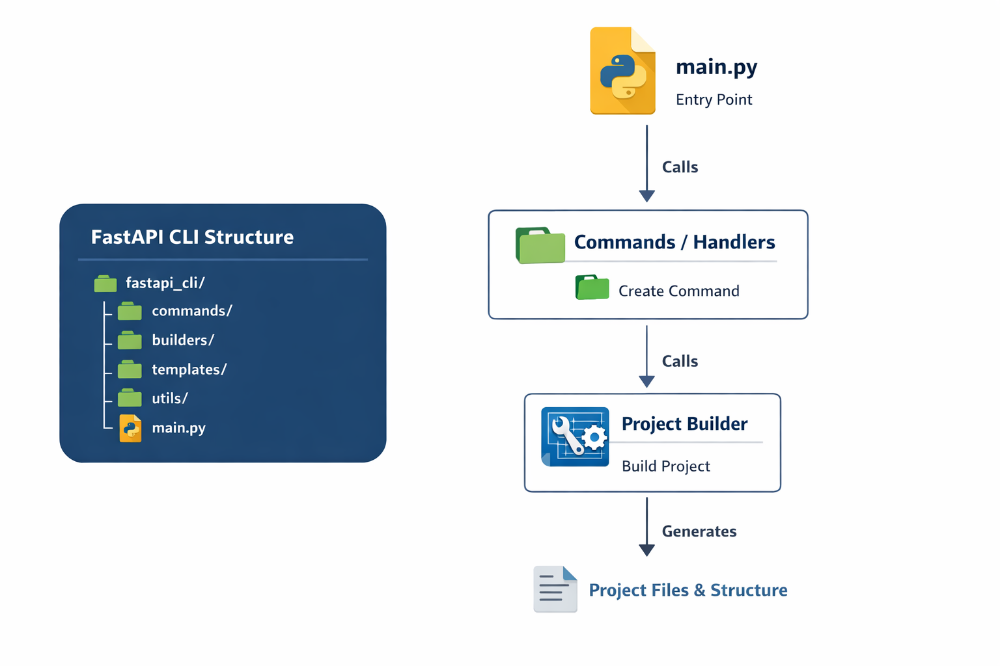

# fast-api-accelerate

This project is a CLI for creating standard backend projects using FastAPI.

## ⚙️ Technologies used: 
dependency manager: uv
web framework:FastAPI
Python 3.10+
Typer (CLI framework)

## 📋 Requirements

Python 3.10 or higher
<p align="center">  </p> <p align="center"> A powerful CLI to scaffold structured and production-ready FastAPI backend projects. </p>

## Pre-requisitos 
-  astral-uv  installed in your machine
```bash
    sudo snap install astral-uv --classic #or
    curl -LsSf https://astral.sh/uv/install.sh | sh && source ~/.bashrc
```

## install dependences 
```bash
    uv sync && source .venv/bin/activate
```

## ⚙️ other commands of uv, examples: add pacjkages
```bash
    uv add fastapi
```
add pacjkages of development
```bash
    uv add --dev pytest &&
    uv add --dev black
```
remove dependences
```bash
    uv remove requests
```

## how to run it on your machine
```bash
    cd fast_api_accelerate && pipx install --editable 
    fast-api-accelerate create project myprojeto
```
To configure the tests in the already created project:
```bash
    fast-api-accelerate tests setup --path my_project
```
from inside the folder with env enabled
```bash
    cd fast_api_accelerate && python3 main.py --help
```

List the subcommands:
create    Create a new FastAPI project
tests     Configure tests for a FastAPI project

📄 License
MIT License
